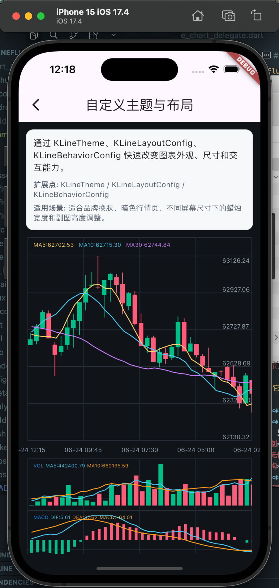
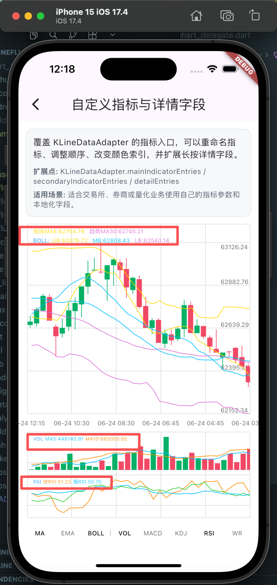
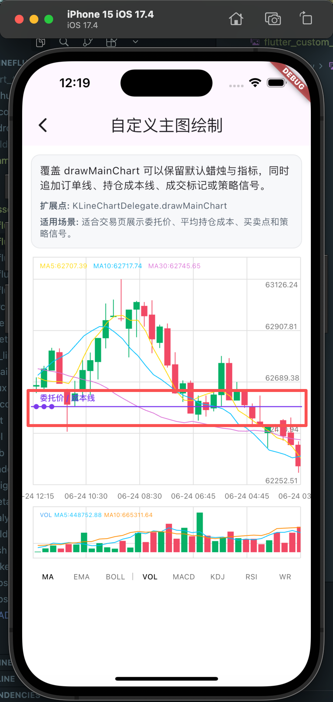

# ZHKLine Flutter

[](https://flutter.dev/)
[](https://dart.dev/)
[](LICENSE)

一个面向金融行情场景的 Flutter 图表库，提供 K 线图、技术指标、交互控制和深度图能力。它以 `CustomPainter` 和 delegate 架构为核心，让你既可以快速接入一套默认 UI，也可以在真实业务中按需替换绘制、布局、覆盖层和数据适配。

详细使用方式、自定义 UI、深度图接入和 example 说明请参考 [`example/use_docs.md`](example/use_docs.md)。

## 效果预览

### 指标切换


### 滚动与缩放


### 长按详情


### 自定义背景



### 自定义指标文案



### 自定义主图绘制



## 为什么选择它

- **快速接入**：简单场景直接使用 `KLineWidget<T>` 和 `KLineDataAdapter<T>`，不需要改造业务模型。
- **高扩展性**：核心绘制通过 `KLineChartDelegate<T>` / `DeepChartDelegate<T>` 暴露，想修改布局或 UI 绘制时，只需要替换对应模块；每个绘制能力都有独立的 default util 抽离，方便复用和二次开发。
- **高性能绘制**：基于 `CustomPainter`，提前计算坐标、可见区节点和绘制数据，避免绘制阶段重复计算。
- **业务模型无侵入**：K 线和深度图都通过 adapter 读取字段，支持任意后端模型。
- **可维护架构**：核心图表、默认实现、主题布局、example 数据层相互隔离，方便测试和逐步替换。
- **可控交互**：`KLineController` 支持外部读取和控制缩放、滚动、选中项、可见区和指标状态。
- **图表能力完整**：内置 MA、EMA、BOLL、MACD、KDJ、RSI、WR、VOL 等常见指标展示，也支持深度图累计盘口展示。

## 快速开始

```bash
git clone https://github.com/911hzh/ZHKLineFlutter.git
cd ZHKLineFlutter
flutter pub get

cd example
flutter pub get
flutter run -d macos
```

## 最小接入

接入时通常只需要准备两部分：

- `MyCandle`：你的业务 K 线数据类，可以来自接口、数据库或本地计算结果。
- `MyCandleAdapter`：把业务数据转换成图表 UI 能识别的 open、high、low、close、volume 和时间文案。

```dart
import 'package:k_line_flutter/k_line_flutter.dart';

class MyCandle {
  const MyCandle({
    required this.open,
    required this.high,
    required this.low,
    required this.close,
    required this.volume,
    required this.timeLabel,
  });

  final double open;
  final double high;
  final double low;
  final double close;
  final double volume;
  final String timeLabel;
}

class MyCandleAdapter extends KLineDataAdapter<MyCandle> {
  const MyCandleAdapter();

  @override
  double open(MyCandle item) => item.open;

  @override
  double high(MyCandle item) => item.high;

  @override
  double low(MyCandle item) => item.low;

  @override
  double close(MyCandle item) => item.close;

  @override
  double volume(MyCandle item) => item.volume;

  @override
  String dateLabel(MyCandle item) => item.timeLabel;
}
```

UI 层在你的某个页面里，直接把数据数组和 adapter 传给 `KLineWidget` 即可：

```dart
class MarketPage extends StatelessWidget {
  const MarketPage({super.key});

  @override
  Widget build(BuildContext context) {
    return KLineWidget<MyCandle>(
      dataSource: candles,
      adapter: const MyCandleAdapter(),
      initialIndicators: const ['volume'],
    );
  }
}
```

深度图也保持同样的接入思路：

```dart
DeepChart<DeepDepthEntry>(
  bids: bids,
  asks: asks,
  adapter: const DeepDepthEntryAdapter(),
)
```

更多自定义绘制、主题、布局、错误态、加载态和 example 数据接入，请查看 [`example/use_docs.md`](example/use_docs.md)。

## 核心能力

### K 线图

- `KLineWidget<T>`：默认 K 线 UI，适合快速接入。
- `KLineChart<T>`：核心图表组件，适合完全自定义绘制。
- `KLineChartDelegate<T>`：绘制协议，可控制布局节点、网格、主图、副图、覆盖层和选中 UI。
- `KLineDataAdapter<T>`：业务模型适配器。
- `KLineController`：缩放、滚动、选中、可见区和指标状态控制。

### 深度图

- `DeepChart<T>`：默认深度图组件。
- `DeepChartDataAdapter<T>`：盘口数据适配器。
- `DeepChartDelegate<T>`：深度图绘制协议。
- `DeepChartLayoutConfig`：中间图形区域和底部价格行的布局配置。

## 简洁项目结构

```text
lib/
├── k_line_flutter.dart
└── src/
    ├── kline/
    └── deepchart/

example/
├── lib/base/api/
├── lib/base/store/
└── lib/module/usecase/pages/
    ├── kline/
    ├── deep_chart/
    └── custom_page/
```

## 适合场景

- 交易所行情页、合约行情页、股票/基金行情页。
- 需要快速接入默认 K 线 UI 的业务。
- 需要深度定制金融图表绘制协议的业务。
- 需要统一维护 K 线、技术指标、盘口深度和图表交互的 Flutter 项目。

## 参与维护

这个库还在持续完善中，欢迎大家一起参与维护：

- 提交 Issue 反馈 Bug、性能问题或 API 设计建议。
- 提交 Pull Request 补充图表能力、example、测试和文档。
- 分享真实业务中的自定义 delegate、主题和交互方案。

如果这个项目对你有帮助，欢迎点一个 Star，也欢迎一起把它维护成更好用的 Flutter 金融图表库。

## License

本项目采用 MIT License，详情见 [LICENSE](LICENSE)。
