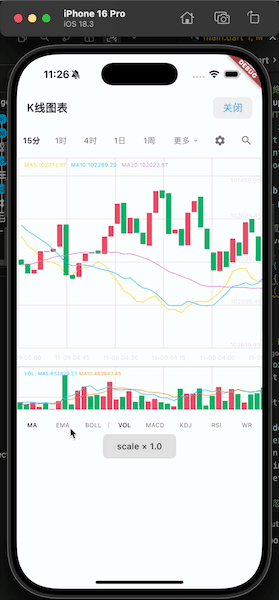
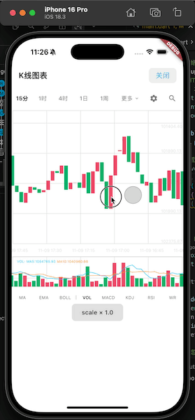
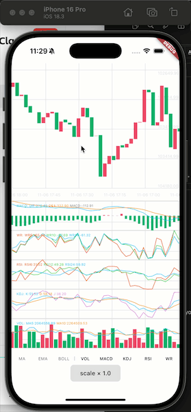

# ZHKLine Flutter 📈

[](https://flutter.dev/)
[](https://dart.dev/)
[](LICENSE)

一个高性能、功能完整且高度可扩展的 Flutter K 线图表库，专为金融应用设计。本项目是 [ZHKLine Swift 版本](https://github.com/911hzh/ZHKLineFlutter/tree/develop)的 Flutter 跨平台实现，采用 delegate 驱动的绘制架构，支持业务方深度自定义图表布局、绘制内容、指标展示、覆盖层、选中详情和交互行为。

**参考火币的 UI 设计实现，数据来源于火币 API**

---

## ✨ 特性

### 🚀 高性能绘制

- ⚡️ **CustomPainter 自定义绘制** - 60 FPS 流畅渲染 2000+ K 线数据
- 📊 **分层架构** - 网格线、蜡烛图、指标线、十字线分层管理，避免重复绘制
- 🎯 **智能渲染** - 只绘制可见区域，大幅降低 CPU/GPU 负载
- 💾 **布局节点缓存** - 可见区节点缓存坐标、宽度和颜色，减少绘制阶段重复计算

### 🧩 高扩展性与自定义 UI

- **Delegate 驱动**: `KLineChartDelegate<T>` 接管高度、布局节点、网格、主图、副图、覆盖层和选中 UI。
- **默认 UI 可替换**: 快速接入可使用 `KLineWidget<T>`，复杂业务可替换 delegate 或复用默认绘制工具。
- **业务模型无侵入**: 通过 `KLineDataAdapter<T>` 适配任意数据结构，不要求继承 package 内置模型。
- **交互可外部控制**: `KLineController` 支持外部读取和驱动缩放、滚动、选中项、可见区和指标状态。

### 📈 完整的技术指标

- **主图指标**: MA (5/10/30)、EMA (5/10/30)、BOLL (20, 2)
- **副图指标**: MACD (12/26/9)、KDJ (9/3/3)、RSI (6/12/24)、WR (6/10/14)、VOL (5/10)
- **指标适配**: 默认 UI 可读取 MA、EMA、BOLL、MACD 等预计算指标，业务方可自定义指标字段和展示文案

### 🎮 流畅的手势交互

- 🔍 **双指缩放** - 0.5x-3.0x 缩放蜡烛宽度
- 📱 **平滑滚动** - 单指拖动浏览历史数据
- ➕ **长按十字线** - 查看特定 K 线详细信息
- 🎨 **专业 UI** - 参考火币设计，涨红跌绿配色方案

### 🌍 跨平台支持

完全匹配 Swift 版本实现，一套代码支持 iOS、Android、Web、Desktop

---

## 📸 效果展示

### 📊 技术指标切换

展示如何在主图和副图之间切换不同的技术指标（MA、BOLL、MACD、KDJ 等），所有指标数据实时渲染，流畅无卡顿。



### 🔄 流畅滚动与缩放

展示单指拖动浏览历史数据和双指缩放功能，支持 0.5x-3.0x 缩放范围，60 FPS 流畅渲染 2000+ K 线数据。



### 📍 长按十字线详情

展示长按图表时显示十字线和数据详情面板，包括当前 K 线的 OHLCV 数据和所有技术指标数值，精准对齐。



---

## 🚀 快速开始

### 安装

```bash
# 克隆项目
git clone https://github.com/911hzh/ZHKLineFlutter.git
cd ZHKLineFlutter

# 安装依赖
flutter pub get

# 运行 example
cd example
flutter pub get
flutter run -d macos  # 或 ios / android
```

### Package 基础用法

新的 package API 推荐只导入一个公共入口。简单场景直接使用 `KLineWidget<T>`，通过 `KLineDataAdapter<T>` 把业务模型映射为 OHLCV、日期和指标值；深度自定义场景可以直接使用 `KLineChart<T>` 和 `KLineChartDelegate<T>`。

```dart
import 'package:k_line_flutter/k_line_flutter.dart';
import 'package:intl/intl.dart';

class MyCandle {
  final double open;
  final double high;
  final double low;
  final double close;
  final double volume;
  final DateTime time;
  final double? ma7;
  final double? ma25;

  MyCandle({
    required this.open,
    required this.high,
    required this.low,
    required this.close,
    required this.volume,
    required this.time,
    this.ma7,
    this.ma25,
  });
}

class MyCandleAdapter extends KLineDataAdapter<MyCandle> {
  const MyCandleAdapter();

  @override
  double open(MyCandle item) => item.open;

  @override
  double high(MyCandle item) => item.high;

  @override
  double low(MyCandle item) => item.low;

  @override
  double close(MyCandle item) => item.close;

  @override
  double volume(MyCandle item) => item.volume;

  @override
  String dateLabel(MyCandle item) {
    return DateFormat('MM-dd HH:mm').format(item.time);
  }

  @override
  double? indicatorValue(
    MyCandle item,
    KLineDefaultIndicatorValue value,
  ) {
    return switch (value) {
      KLineDefaultIndicatorValue.ma5 => item.close,
      _ => null,
    };
  }

  @override
  List<KLineIndicatorEntry> mainIndicatorEntries(
    MyCandle item,
    KLineDefaultIndicatorType type,
  ) {
    if (type == KLineDefaultIndicatorType.ma) {
      return [
        KLineIndicatorEntry(label: 'MA7', value: item.ma7, colorIndex: 0),
        KLineIndicatorEntry(label: 'MA25', value: item.ma25, colorIndex: 1),
      ];
    }
    return super.mainIndicatorEntries(item, type);
  }
}

KLineWidget<MyCandle>(
  dataSource: candles,
  adapter: const MyCandleAdapter(),
  initialIndicators: const ['volume'],
  onScroll: (context, metrics) {
    // 根据 metrics.extentBefore / extentAfter 判断是否加载更多数据。
  },
  theme: const KLineTheme(),
)
```

这套 API 的核心是：

- `dataSource: List<T>`：外部直接提供需要绘制的数据数组。
- `KLineDataAdapter<T>`：把任意业务模型映射成默认绘制需要的字段，不要求业务模型继承 package model。
- `KLineWidget<T>`：内置默认网格、蜡烛、指标、副图、选中详情和 loading/error/empty UI，也支持传入自定义 delegate。
- `KLineChartDelegate<T>`：外部决定图表高度、布局节点、网格层、主图、副图、选中 UI 和交互回调。
- `KLineChartContext<T>`：package 在每次绘制和交互时传入的上下文，包含 controller、可见区、布局节点、视口尺寸、主题和布局配置。
- `KLineController`：对外暴露缩放、滚动、选中项、可见区间等状态。

### 自定义绘制示例

```dart
class OrderLineDelegate extends KLineChartDelegate<MyCandle> {
  @override
  void drawGrid(Canvas canvas, Size size, KLineChartContext<MyCandle> context) {
    super.drawGrid(canvas, size, context);
    final paint = Paint()
      ..color = Colors.orange
      ..strokeWidth = 1;

    canvas.drawLine(
      Offset(0, size.height / 2),
      Offset(size.width, size.height / 2),
      paint,
    );
  }
}
```

### 自定义配置

```dart
KLineWidget<MyCandle>(
  dataSource: candles,
  adapter: const MyCandleAdapter(),
  theme: const KLineTheme(
    candleUpColor: Color(0xFFF14965),
    candleDownColor: Color(0xFF00B066),
  ),
  layout: const KLineLayoutConfig(
    candleWidth: 8,
    candleSpacing: 2,
    mainChartHeight: 360,
  ),
  behavior: const KLineBehaviorConfig(
    enableScale: true,
    enableCrosshair: true,
  ),
)
```

---

## 📖 核心组件

### KLineChart

package 核心组件，只负责滚动、手势、视口上下文和代理调度，不包含具体 K 线业务绘制。

```dart
KLineChart<T>(
  dataSource: List<T>,                 // 数据数组
  delegate: KLineChartDelegate<T>,     // 绘制和交互代理
  controller: KLineController?,        // 状态控制器
  theme: KLineTheme,                   // 主题配置
  layout: KLineLayoutConfig,           // 布局配置
  behavior: KLineBehaviorConfig,       // 交互配置
  isLoading: bool,                     // 是否展示核心 loading 占位
  loadingBuilder: WidgetBuilder?,      // 自定义 loading UI
  emptyBuilder: WidgetBuilder?,        // 自定义空数据 UI
)
```

### KLineWidget

默认 UI 组件，内部使用 `KLineDefaultDelegateImpl<T>`，适合快速接入一套完整 K 线图。

```dart
KLineWidget<T>(
  dataSource: List<T>,              // 数据数组
  adapter: KLineDataAdapter<T>,     // 数据适配器
  delegate: KLineChartDelegate<T>?, // 自定义绘制和交互代理
  controller: KLineController?,     // 状态控制器
  initialIndicators: Iterable<String>?, // 内部 controller 的初始指标
  onScroll: (context, metrics) {},  // 用户滚动回调，可用于加载更多
  isLoading: bool,                  // 后台刷新或首次加载状态
  error: Object?,                   // 错误覆盖层
  onRetry: VoidCallback?,           // 默认错误占位的重试回调
  loadingBuilder: WidgetBuilder?,   // 自定义 loading UI
  emptyBuilder: WidgetBuilder?,     // 自定义空数据 UI
  errorBuilder: Widget Function(BuildContext, Object, VoidCallback?)?, // 自定义错误 UI
)
```

### KLineDataAdapter

默认绘制实现通过 adapter 读取业务模型字段，避免要求业务模型继承 package 的固定 model。

```dart
abstract class KLineDataAdapter<T> {
  double open(T item);
  double high(T item);
  double low(T item);
  double close(T item);
  double volume(T item);
  String dateLabel(T item);
  double? indicatorValue(T item, KLineDefaultIndicatorValue value);
  List<KLineIndicatorEntry> mainIndicatorEntries(T item, KLineDefaultIndicatorType type);
  List<KLineIndicatorEntry> secondaryIndicatorEntries(T item, KLineDefaultIndicatorType type);
  List<KLineDetailEntry> detailEntries(T item);
}
```

### KLineChartDelegate

绘制和交互协议，外部负责网格、蜡烛、指标、覆盖层、选中 UI 和交互回调。

```dart
abstract class KLineChartDelegate<T> {
  double chartHeight(KLineChartContext<T> context);
  List<KLineLayoutNode<T>> getLayoutNodes(
    KLineChartContext<T> context,
    List<T> dataSource,
  );
  void drawChart(Canvas canvas, Size size, KLineChartContext<T> context);
  void drawGrid(Canvas canvas, Size size, KLineChartContext<T> context);
  void drawMainChart(Canvas canvas, Size size, KLineChartContext<T> context);
  void drawSecondaryCharts(Canvas canvas, Size size, KLineChartContext<T> context);
  Widget? buildSelectionView(
    BuildContext context,
    KLineChartContext<T> chartContext,
    KLineLayoutNode<T> selectedNode,
  );
  Widget? buildOverlayView(BuildContext context, KLineChartContext<T> chartContext);
  void didScroll(KLineChartContext<T> context, KLineScrollMetrics metrics);
  void didSelectItem(KLineChartContext<T> context, KLineLayoutNode<T> node);
  void didMoveSelection(KLineChartContext<T> context, KLineLayoutNode<T> node);
}
```

---

## 🏗 架构设计

### 核心设计原则

1. **数据外置** - package 不绑定固定业务模型，外部通过 `List<T>` 和 `KLineDataAdapter<T>` 提供字段。
2. **Delegate 驱动** - core 只负责视口、滚动、手势和调度，业务绘制由 `KLineChartDelegate<T>` 决定。
3. **默认实现可替换** - `KLineWidget<T>` 提供开箱即用 UI，深度定制时可以替换 delegate 或复用默认 util。
4. **分层绘制** - 固定网格、滚动内容、覆盖层、选中详情分层管理，降低重复绘制成本。

### 绘制流程

```
业务数据 → Adapter / Delegate → 可见区与布局节点 → CustomPainter 绘制 → 手势与 Controller 状态
   ↓             ↓                  ↓                    ↓                    ↓
List<T>  →  KLineDataAdapter  →  KLineLayoutNode  →  Canvas.draw  →  KLineController
```

### 关键组件

| 组件                     | 职责                                   |
| ------------------------ | -------------------------------------- |
| **KLineChart**           | 滚动、手势、视口上下文和代理调度       |
| **KLineWidget**          | 基于 adapter 的默认 K 线 UI 组件       |
| **KLineDataAdapter**     | 将业务模型映射为默认绘制字段           |
| **KLineDefaultDelegateImplUtil** | 默认 delegate 的可复用绘制/布局工具 |
| **List<T> dataSource**   | 当前图表需要绘制的数据数组             |
| **KLineChartDelegate**   | 布局节点、网格、主图、副图、选中 UI 绘制 |
| **KLineChartContext**    | 每次绘制和交互时传给外部的上下文       |
| **KLineController**      | 缩放、滚动、选中项、可见区间状态       |

---

## 📊 技术指标

核心 package 不强制接管 MA、EMA、BOLL、MACD 等业务指标计算。使用默认 UI 时，业务层可以预先计算好指标数据，并通过 `KLineDataAdapter.indicatorValue` 返回数值；如果指标参数、标题、颜色或展示顺序不同，可以覆盖 `mainIndicatorEntries` / `secondaryIndicatorEntries` 返回自己的 label 配置。长按详情字段可以通过 `detailEntries` 本地化或扩展。深度自定义时，也可以在 `KLineChartDelegate.getLayoutNodes` / `drawMainChart` / `drawSecondaryCharts` 中自行计算并绘制。

---

## 📁 项目结构

```
lib/
├── k_line_flutter.dart              # package 公共入口
└── src/kline/
    ├── controller/                  # KLineController
    ├── delegate/                    # Delegate / Context
    ├── theme/                       # Theme / Layout / Behavior 配置
    ├── u_default_impl/              # Adapter / 默认 Delegate / KLineWidget / 默认绘制工具
    └── widgets/                     # KLineChart 核心组件

example/
├── lib/base/
│   ├── api/                         # RestClient、火币 K 线 API 和返回模型
│   ├── store/                       # KlineStore、认证、设置等状态与持久化示例
│   └── util/                        # K 线指标计算和通用工具
└── lib/module/usecase/pages/kline/
    ├── KLineDemoCubit.dart          # 页面状态、周期切换、刷新和加载更多
    ├── KLineDemoPage.dart           # KLineWidget 装配和交互入口
    ├── kline_model_adapter.dart     # example 模型到 package adapter 的映射
    └── kline_demo_widgets.dart      # 顶部栏、周期选择等页面组件
```

---

## 🎯 与 Swift 版本对应

| 功能       | Swift              | Flutter               |
| ---------- | ------------------ | --------------------- |
| **绘制层** | CALayer            | CustomPainter         |
| **视图层** | UIView             | StatefulWidget        |
| **滚动**   | UIScrollView       | SingleChildScrollView |
| **缩放**   | UIPinchGesture     | onScaleUpdate         |
| **长按**   | UILongPressGesture | onLongPress           |
| **配置**   | 配置对象           | KLineTheme/Layout     |
| **数据**   | DataSource         | List<T> + Adapter     |
| **代理**   | Delegate           | KLineChartDelegate    |

---

## 📊 性能数据

| 测试场景   | 数据量  | 帧率   | 内存  |
| ---------- | ------- | ------ | ----- |
| 滚动浏览   | 2000 条 | 60 FPS | ~50MB |
| 双指缩放   | 2000 条 | 60 FPS | ~50MB |
| 长按十字线 | 2000 条 | 60 FPS | ~50MB |
| 切换指标   | 2000 条 | 60 FPS | ~55MB |

---

## 🛠 技术栈

- **Flutter**: 3.7.0+
- **Dart**: 3.7.0+
- **intl**: ^0.19.0 - 日期格式化
- **dio**: ^5.9.0 - example 网络请求
- **get_it / injectable** - example 依赖注入
- **flutter_bloc** - example K 线 Demo 页面状态管理
- **flutter_foundation_kit** - example RestClient、Store 和 Repository 基础能力

---

## 🤝 贡献

欢迎提交 Issue 和 Pull Request！

### 提交规范

- `feat`: 新功能
- `fix`: Bug 修复
- `docs`: 文档更新
- `style`: 代码格式
- `refactor`: 重构
- `perf`: 性能优化

---

## 📄 License

本项目采用 MIT 许可证 - 查看 [LICENSE](LICENSE) 文件了解详情。

---

## 🔗 相关链接

- **Swift 版本**: [ZHKLine iOS](https://github.com/911hzh/ZHKLineFlutter/tree/develop)
- **数据来源**: [火币 API](https://huobiapi.github.io/docs/spot/v1/cn/)
- **Flutter 文档**: [flutter.dev](https://flutter.dev/)

---

## 📮 联系方式

- **作者**: 911hzh
- **邮箱**: 911hzh@gmail.com
- **Issues**: [GitHub Issues](https://github.com/911hzh/ZHKLineFlutter/issues)

---

<div align="center">

**使用 ❤️ 和 Flutter 构建**

如果这个项目对你有帮助，请给一个 ⭐️ Star！

</div>
