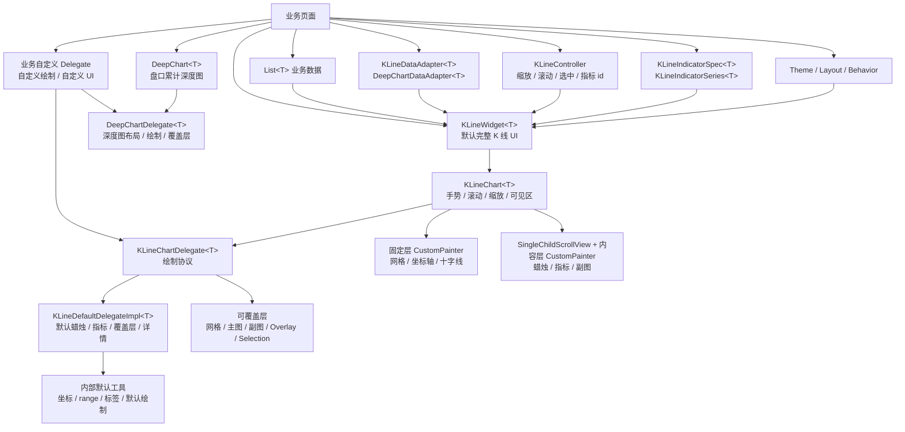

# ZHKLine Flutter 架构图

外部业务侧主要关注数据、适配器、controller、指标定义、主题布局和可选 delegate；
package 内部负责滚动、缩放、可见区计算、绘制分层和默认 UI 组合。

需要快速接入时，只看 `KLineWidget<T>`、`KLineDataAdapter<T>` 和
`KLineController`。需要自定义指标时，再看 `KLineIndicatorSpec<T>`。需要替换
绘制或 UI 时，传入业务自定义 delegate：想保留默认能力就继承
`KLineDefaultDelegateImpl<T>` 并调用 `super`，想完全接管绘制流程就实现
`KLineChartDelegate<T>` / `DeepChartDelegate<T>`。

[返回 README](../README.md)
